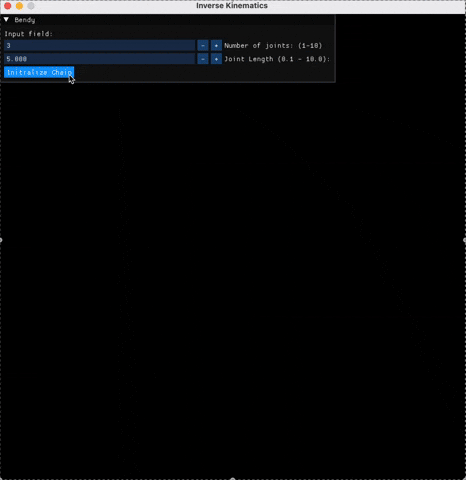
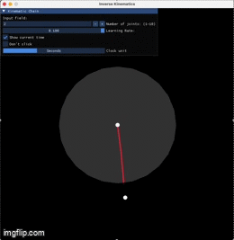
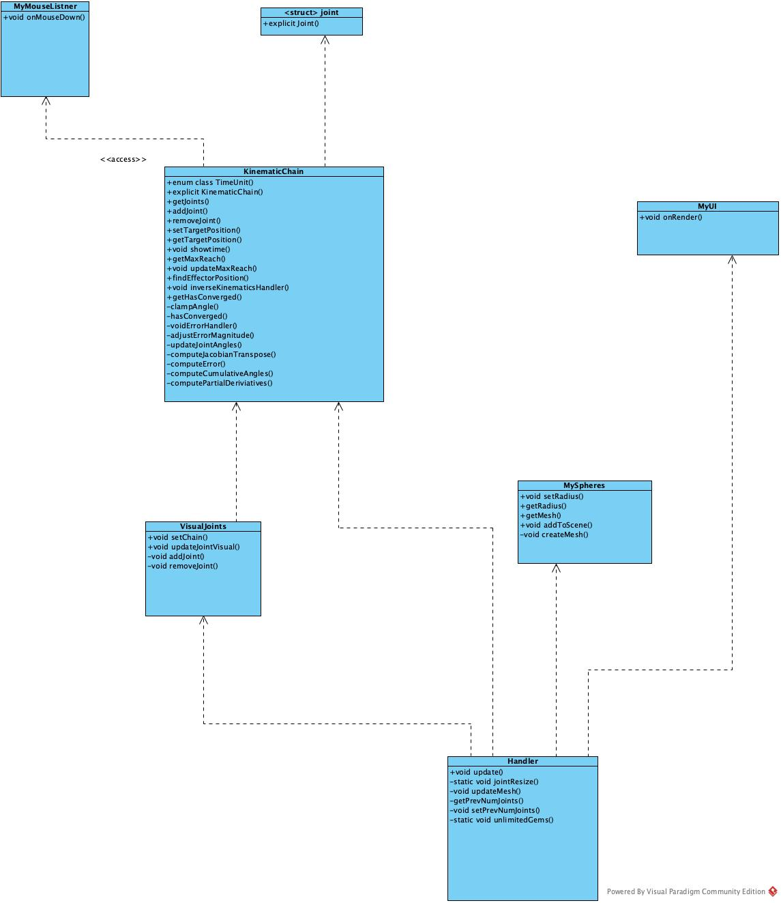

# 2D InverseKinematics solver 

Inverse Kinematics in 2D, using Jacobian Matrix Solver for C++ assignment.
The code can be used as a framework for programming further applications using inverse kinematics.
By using imgui, the user can adjust numbers of joints, the length of the joints, learning rate and 2 different modes for targetposition. One being determined by mouse input and other being an emulated version of a clock that takes the current time of users device.

This is the clock, time was 16:32

uml diagram

