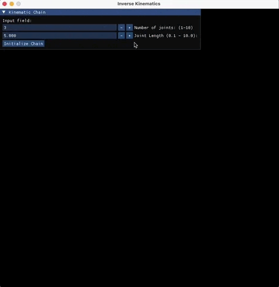

# threepp custom project

This is a simple example of how to use consume [threepp](https://github.com/markaren/threepp) using CMake's FetchContent.

Includes Imgui as a bundled dependency.

<<iframe src="https://giphy.com/embed/3gaWLZX1QLPDanmIV1" width="466" height="480" style="" frameBorder="0" class="giphy-embed" allowFullScreen></iframe>
<a href="https://giphy.com/gifs/imgui-3gaWLZX1QLPDanmIV1">via GIPHY</a>
>
